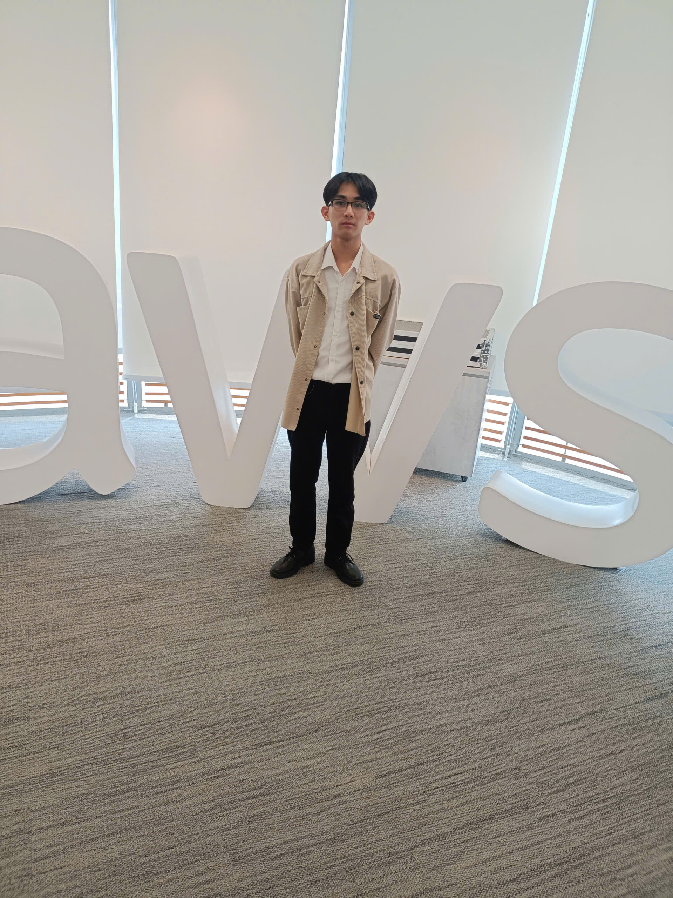

| Thông tin   | Chi tiết                                                                                  |
| ------------ | ------------------------------------------------------------------------------------------ |
| Ngày        | 09/05/2026                                                                                 |
| Địa điểm | Tầng 26, tòa nhà Bitexco, số 02 đường Hải Triều, phường Sài Gòn, thành phố Hồ Chí Minh |
| Vai trò     | Người tham dự                                                                           |

### Mục Đích Của Sự Kiện

- Chia sẻ phương pháp duy trì động lực và xây dựng thói quen học tập hiệu quả.
- Chia sẻ kinh nghiệm khai thác AI thông qua Prompt Engineering để nâng cao chất lượng kết quả.
- Giới thiệu kiến trúc Serverless trên AWS và các dịch vụ thường được sử dụng.
- Chia sẻ góc nhìn về nền tảng kiến thức, tư duy và định hướng nghề nghiệp của kỹ sư phần mềm.
- Chia sẻ phương pháp phối hợp AI Agent trong quy trình phát triển phần mềm.

### Danh Sách Diễn Giả

- **Mr. Huynh Hoang Long** - Chia sẻ về tâm lý học trong học tập và cách duy trì động lực.
- **Mr. Thinh Nguyen** - Trình bày về Prompt Engineering, AI và kiến trúc Serverless trên AWS.
- **Mr. Khang** - Chia sẻ về kinh nghiệm khi làm việc tại văn phòng, một chút về vấn đề AI.
- **Ms. Thao** - Chia sẻ về AI Agent trong quá trình phát triển phần mềm.

### Nội Dung Nổi Bật

#### Xây dựng động lực học tập

Giới thiệu một số phương pháp giúp duy trì việc học trong thời gian dài. Thay vì cố gắng học quá nhiều trong một lần, nên chia mục tiêu thành những phần nhỏ để dễ thực hiện. Đồng thời, việc tạo các mốc hoàn thành hoặc duy trì chuỗi ngày học liên tục cũng giúp tăng tính kỷ luật và giảm cảm giác chán nản.

Nên xử lý ngay các công việc nhỏ có thể hoàn thành trong 2 phút để tránh tích tụ và hình thành thói quen trì hoãn.

#### Prompt Engineering và kiến trúc Serverless

Cách xây dựng prompt hiệu quả khi làm việc với các mô hình ngôn ngữ lớn. Một prompt tốt cần xác định rõ vai trò, mục tiêu, bối cảnh, dữ liệu đầu vào và định dạng đầu ra mong muốn. Bên cạnh đó, các kỹ thuật như Chain of Thought được giới thiệu nhằm hỗ trợ mô hình suy luận tốt hơn trong các bài toán phức tạp.

Diễn giả cũng minh họa một kiến trúc Serverless trên AWS như:

- Amazon S3 và CloudFront.
- Amazon Cognito.
- API Gateway và AWS Lambda.
- Amazon Bedrock.
- DynamoDB và CloudWatch.

#### Nền tảng và tư duy nghề nghiệp

Quan điểm AI chỉ đóng vai trò hỗ trợ, không thể thay thế kiến thức nền và khả năng tư duy của lập trình viên. Vì vậy, việc hiểu bản chất của hệ thống, thường xuyên đặt câu hỏi "vì sao" và duy trì chất lượng công việc là những yếu tố quan trọng trong quá trình phát triển sự nghiệp.

Diễn giả cũng khuyến khích sinh viên tập trung tích lũy kinh nghiệm, mở rộng mối quan hệ và học hỏi liên tục thay vì chỉ quan tâm đến thu nhập ở giai đoạn đầu.

#### AI Agent trong quy trình phát triển phần mềm

Giới thiệu mô hình phân chia AI thành nhiều vai trò khác nhau tương ứng với từng giai đoạn của SDLC. Mỗi AI Agent phụ trách một nhiệm vụ riêng như phân tích yêu cầu, thiết kế hệ thống, lập trình hoặc kiểm thử. Cách tiếp cận này giúp giảm nhầm lẫn về ngữ cảnh, nâng cao chất lượng đầu ra và hỗ trợ nhóm phát triển làm việc hiệu quả hơn.

### Những Gì Học Được

Phương pháp tự quản lý và tối ưu hiệu suất: Biết cách chia nhỏ mục tiêu dài hạn thành các cột mốc ngắn hạn để duy trì tính kỷ luật; áp dụng quy tắc 2 phút để giải quyết nhanh các tác vụ nhỏ, ngăn ngừa triệt để thói quen trì hoãn.

Tư duy thiết kế Prompt và kiến trúc Cloud: Nắm vững cấu trúc 5 yếu tố cốt lõi của một prompt tối ưu (vai trò, mục tiêu, bối cảnh, đầu vào, định dạng đầu ra) và kỹ thuật Chain of Thought; hiểu cách phối hợp các dịch vụ AWS (S3, CloudFront, Cognito, API Gateway, Lambda, Bedrock, DynamoDB) để vận hành một hệ thống Serverless AI hoàn chỉnh.

Định vị bản thân trong kỷ nguyên AI: Xác định rõ tư duy phản biện, việc đào sâu bản chất hệ thống và kiến thức nền tảng là giá trị cốt lõi không thể thay thế của lập trình viên; chuyển dịch mục tiêu từ tìm kiếm thu nhập ngắn hạn sang tích lũy trải nghiệm và xây dựng mạng lưới quan hệ trong giai đoạn đầu sự nghiệp.

Ứng dụng AI Agent vào quy trình công việc: Hiểu được tư duy module hóa các tác vụ phát triển phần mềm (SDLC) bằng cách chia nhỏ vai trò cho từng AI Agent chuyên biệt (phân tích, thiết kế, code, test) nhằm tối ưu hóa ngữ cảnh và nâng cao chất lượng sản phẩm đầu ra.

#### Minh chứng tham gia sự kiện

