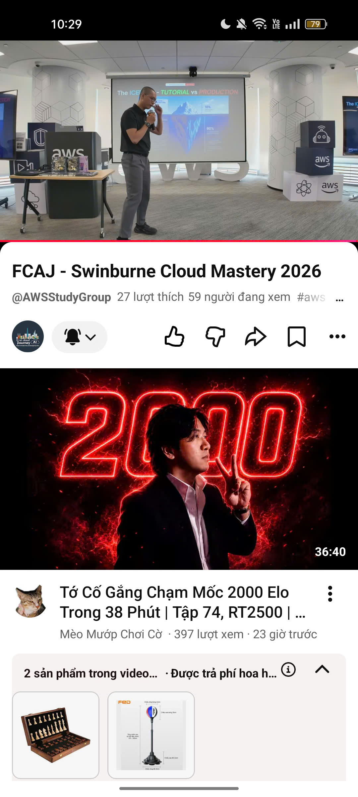

| Information | Details                                                                                    |
| ----------- | ------------------------------------------------------------------------------------------ |
| Date        | 04/07/2026                                                                                 |
| Location    | 26th Floor, Bitexco Tower, No. 02 Hai Trieu Street, Sai Gon Ward, Ho Chi Minh City         |
| Role        | Online attendee                                                                            |

### Purpose of the Event
- Create opportunities for Swinburne Vietnam students to gain practical insights into cloud computing and application architecture in enterprise environments.
- Connect students with industry professionals currently working in the field through the AWS First Cloud AI Journey community to learn practical experiences.

### List of Speakers

- **Mr. Nguyen Gia Hung** - Head of Solutions Architects in Vietnam & Cambodia, Amazon Web Services.
- **Mr. Khang Nguyen** - Solutions Architect, Cloud Kinetics.
- **Ms. Nhu Tran** - Account Manager, Amazon Web Services.
- **Mr. Vinh Banh** - Senior Data Engineer, Renova Cloud.

### Key Highlights

#### Mr. Nguyen Gia Hung - Market overview and Cloud Computing career trends
- The current IT job market is extremely harsh and highly competitive. Businesses have strict requirements even for intern positions, typically requiring candidates to have a good understanding of K8S.
- Cloud is an irreversible trend, with a market size that has far exceeded traditional hardware devices. Large enterprises today all prioritize a Cloud-first strategy when developing applications.
- The development of AI forces juniors to improve their capabilities to solve complex problems equivalent to the senior level.

#### Mr. Vinh Banh - The difference between studying at school and working in reality
- The learning environment usually has clean data, clear requirements, and comfortable completion times. Conversely, the real-world environment requires handling complex data from multiple sources, constantly changing requirements, and extremely tight time pressure.
- Need to master the framework instead of just rote learning how to use tools.
- AI will support faster work but will not completely replace humans. Business understanding and communication skills are values that AI cannot replace.

#### Ms. Nhu Tran - Overcoming fears and seizing opportunities
- Students need to learn how to face and overcome the fear of making mistakes as well as the pressure from others' judgments.
- Communication is an extremely important factor to avoid unnecessary misunderstandings in the workplace.
- Proactively building presence through small talk will help bridge the gap with superiors.

#### Mr. Khang Nguyen - Skills, Mindset, and pressure from AI
- Students can use AI tools to assist with assignments, but absolutely must not outsource their entire thinking to AI.
- It is necessary to clearly understand the root of knowledge instead of just relying on the output results.
- For Fresher positions, employers value attitude the most, followed by professional qualifications and practical experience.

### What I Learned
- Enhance presence: You cannot just passively practice skills but must also proactively expand your network of relationships and participate in professional communities.
- Invest in long-term value: Continuously improve yourself and demonstrate a lifelong learning spirit to enhance your competitive value in the eyes of employers.
- Broaden business perspectives: When orienting your career, do not just focus on technical expertise but also equip yourself with knowledge about the specific business characteristics of particular industry groups.

#### Proof of participation

