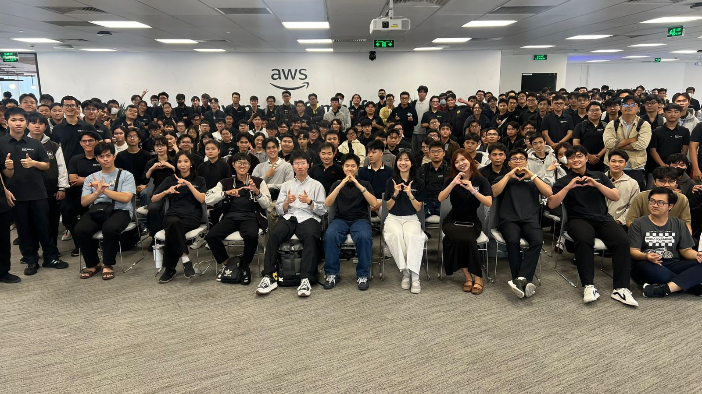
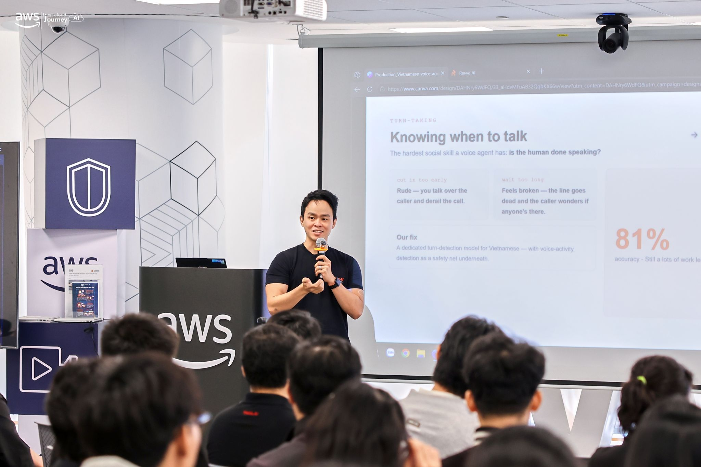
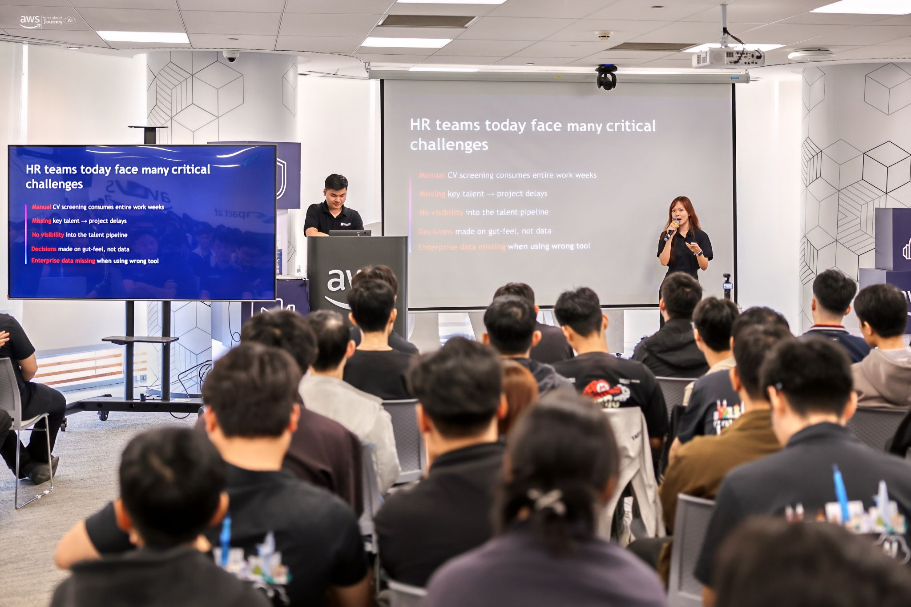
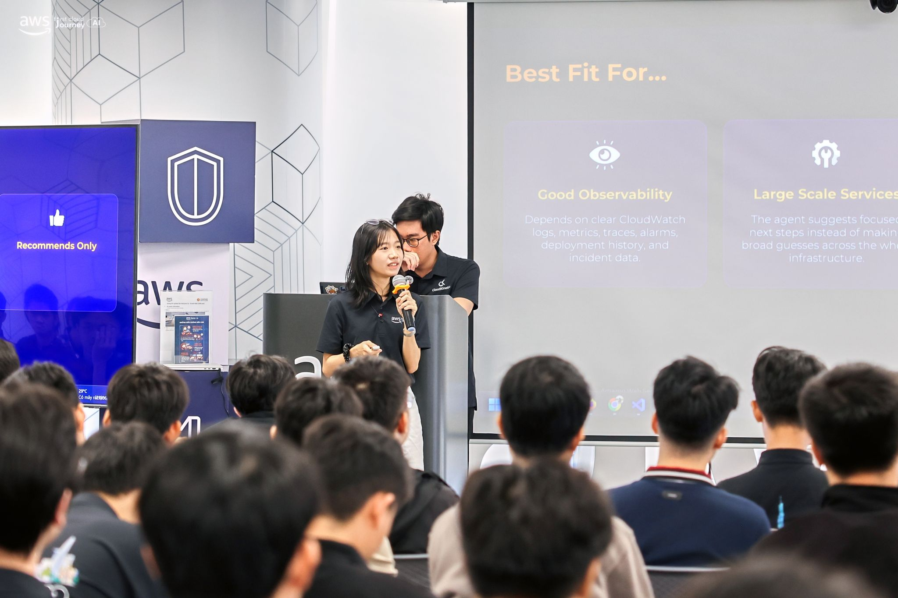

# Bài thu hoạch “FCAJ Community Day: AI-Driven Operations & Enterprise Solutions”

### Mục Đích Của Sự Kiện
- Cập nhật các giải pháp vận hành tự động bằng AI (Autonomous Operations) giúp phá vỡ rào cản phức tạp của hạ tầng Cloud hiện đại.
- Tiếp cận làn sóng công nghệ tương tác thế hệ mới thông qua các mô hình AI Voice Agent (Speech-to-Speech) xử lý thời gian thực độ trễ thấp.
- Tìm hiểu xu hướng Multi-Agent (Đa đại lý thông minh) phối hợp giải quyết các sự cố DevOps và tự động hóa quy trình quản trị doanh nghiệp.
- Làm chủ giải pháp bảo mật nâng cao khi tích hợp các nền tảng AI Assistant (Amazon Quick) với hệ thống dữ liệu nội bộ qua kết nối riêng tư (VPC Private Connectivity).

---

### Nội Dung Nổi Bật

#### 1. Deep Response Engine: From Detection to Autonomous Resolution
- **Thách thức:** Sự phức tạp của hệ thống Cloud hiện đại tạo ra quá nhiều cảnh báo (Alert Fatigue), khiến các kỹ sư vận hành bị quá tải và chậm trễ trong việc xử lý.
- **Dịch chuyển tư duy:** Thay đổi từ hệ thống chỉ biết phát cảnh báo (Alert-driven) sang hệ thống tự động ra quyết định và hành động (Action-driven).
- **Kiến trúc Deep Response Engine:** Tự động bắt giữ các sự cố ngay khi vừa phát hiện, phân tích nguyên nhân gốc rễ bằng AI và kích thích các kịch bản tự phục hồi hệ thống mà không cần con người can thiệp thủ công.
- **Giá trị thực tiễn:** Giảm thiểu tối đa thời gian gián đoạn dịch vụ, hướng tới mục tiêu vận hành không downtime (Zero-downtime) và tối ưu chi phí vận hành cho doanh nghiệp.

#### 2. Voice Agents: Building Human-Like AI Conversations at Scale
- **Sự tiến hóa:** Bước chuyển dịch mạnh mẽ từ hệ thống trả lời tự động IVR truyền thống và Chatbot dạng kịch bản cứng nhắc sang thế hệ AI Voice Agents có khả năng trò chuyện tự nhiên như người thật.
- **Rào cản kỹ thuật:** Ba thách thức lớn nhất của một Voice Agent là độ trễ truyền tải (Latency), độ chính xác ngữ cảnh (Accuracy) và nhịp điệu tương tác tự nhiên.
- **Giải pháp công nghệ:** Ứng dụng mô hình nền tảng thế hệ mới *Amazon Nova Sonic* chuyên dụng cho tương tác giọng nói trực tiếp (Speech-to-Speech).
- **Kiến trúc tích hợp:** Kết hợp luồng xử lý từ hạ tầng viễn thông (Telephony), truyền tải dữ liệu dạng chuỗi (Streaming), năng lực hiểu ngôn ngữ của *Amazon Bedrock* và khả năng mở rộng công cụ qua giao thức MCP (Model Context Protocol).

#### 3. AWS DevOps Agent: Your Always-Available Operations Teammate
- **Tổng quan:** Giới thiệu AWS DevOps Agent đóng vai trò như một trợ lý vận hành ảo luôn túc trực 24/7 bên cạnh đội ngũ kỹ sư.
- **Tối ưu chỉ số vận hành:** Ứng dụng AI giúp đẩy nhanh tốc độ phát hiện sự cố (MTTD) và rút ngắn thời gian phản hồi, khắc phục hệ thống (MTTR).
- **Khả năng thích ứng:** Hỗ trợ linh hoạt cả môi trường đa đám mây (Multi-cloud) lẫn hạ tầng lai (Hybrid Environments).
- **Phương pháp luận Multi-Agent:** Sử dụng framework *Bedrock AgentCore* để triển khai kiến trúc đa đại lý, cho phép nhiều AI chuyên biệt phối hợp phân tích, phản biện độc lập để tìm ra phương án sửa lỗi tối ưu nhất trên hệ thống container (Amazon ECS).

#### 4. AI-Powered Productivity: Workforce Planning For Enterprise
- **Bối cảnh:** Các thách thức lớn trong việc chuyển đổi số phòng Nhân sự (HR) tại các tập đoàn lớn khi phải quản lý và tối ưu hóa nguồn lực quy mô lớn.
- **Công cụ hỗ trợ:** Tổng quan về nền tảng trợ lý thông minh *Amazon Quick* và các phân hệ tính năng chuyên sâu dành cho quản trị nguồn nhân lực.
- **Tự động hóa tác vụ:** Tăng tốc các quy trình xét duyệt, vận hành HR thường nhật thông qua cơ chế tự động hóa thông minh.
- **Tư duy dữ liệu:** Khai thác sâu các chỉ số phân tích nhân sự (Workforce Analytics) giúp ban lãnh đạo đưa ra các quyết định chiến lược về phân bổ nhân sự dựa trên dữ liệu thực tế thay vì cảm tính.

#### 5. Building Secure Private MCP Connection with Amazon Quick
- **Bản chất của Amazon Quick:** Đóng vai trò là một nền tảng trợ lý AI cốt lõi (AI Assistant Platform) có khả năng kết nối linh hoạt với nhiều hệ thống nghiệp vụ.
- **Vai trò của Giao thức MCP:** *Model Context Protocol (MCP)* đóng vai trò như một tiêu chuẩn mở giúp các mô hình AI mở rộng khả năng kết nối, truy vấn trực tiếp vào các nguồn dữ liệu bên ngoài.
- **Bảo mật kết nối:** Giải quyết nguy cơ rò rỉ dữ liệu khi AI truy vấn dữ liệu nội bộ bằng cách cấu hình mạng riêng tư *VPC Private Connectivity*.
- **Giải pháp triển khai:** Thiết lập các endpoint bảo mật trong VPC giúp dữ liệu trao đổi giữa Amazon Quick và các máy chủ MCP luôn đi trong mạng nội bộ AWS, hoàn toàn tách biệt khỏi internet công cộng.

---

### Những Gì Học Được

#### Tư Duy Thiết Kẽ
- **Tư duy tự động hóa cấp độ cao (Autonomous Mindset):** Nhận thức được rằng hệ thống giám sát hiện đại không chỉ dừng lại ở việc vẽ Dashboard hay gửi cảnh báo qua Slack/Telegram, mà phải hướng tới khả năng tự phân tích và kích hoạt Script tự sửa lỗi.
- **Tư duy mở rộng bằng Giao thức chung (MCP Protocol):** Hiểu được tầm quan trọng của việc chuẩn hóa giao tiếp thông qua MCP để giúp một mô hình AI có thể nói chuyện và điều khiển được nhiều hệ thống cơ sở dữ liệu khác nhau một cách dễ dàng.
- **Tư duy bảo mật Zero-Trust trên Cloud:** Nhận thấy bất kỳ kết nối AI nào liên quan đến dữ liệu doanh nghiệp cũng cần được cô lập trong môi trường mạng riêng tư (VPC Private), chặn hoàn toàn mọi truy cập công cộng để bảo vệ an toàn thông tin.

#### Kiến Trúc Kỹ Thuật
- Nắm rõ kiến trúc luồng dữ liệu thời gian thực của hệ thống Voice AI độ trễ thấp sử dụng mô hình gốc *Amazon Nova Sonic*.
- Hiểu cách phối hợp nhiều AI Agent (`Multi-agent reasoning`) thông qua *Bedrock AgentCore* để chúng tự chia nhỏ tác vụ và sửa lỗi hạ tầng.
- Biết cách thiết lập kết nối an toàn cho Trợ lý AI kết nối qua VPC Endpoint để truy vấn tài nguyên hệ thống một cách riêng tư và bảo mật.

---

### Ứng Dụng Vào Công Việc
- **Xây dựng kịch bản tự động hóa cho đồ án:** Áp dụng tư duy của *Deep Response Engine* vào các bài tập lớn quản trị hệ thống Linux/Windows; thay vì chỉ dùng Nagios/Zabbix để bắt lỗi, tôi sẽ viết thêm các đoạn Script tự động Restart lại service (Apache, MySQL) khi phát hiện sự cố sập dịch vụ.
- **Tối ưu hóa kiến trúc mạng nội bộ:** Vận dụng kiến thức thiết lập *VPC Private Connectivity* vào các bài thực hành thiết kế hệ thống Cloud trên AWS, đảm bảo các tài nguyên nhạy cảm như RDS (Database) luôn nằm trong Private Subnet và giao tiếp qua Endpoint an toàn.
- **Nghiên cứu ứng dụng Voice Bot:** Thử nghiệm tích hợp API của các mô hình ngôn ngữ lớn để xây dựng một ứng dụng tổng đài thoại hoặc chatbot thông minh phục vụ cho dự án thực tế sắp tới.

---

### Trải Nghiệm Trong Event
- **Tiếp cận các công nghệ tiên phong:** Được chứng kiến trực tiếp các buổi Live Demo về khả năng tự sửa lỗi hệ thống của AI và khả năng trò chuyện không độ trễ của Amazon Nova Sonic đem lại trải nghiệm vô cùng bùng nổ về mặt thị giác và công nghệ.
- **Thu hẹp khoảng cách lý thuyết và thực tế:** Hiểu được cách các tập đoàn lớn giải quyết bài toán nhân sự hay bảo mật hệ thống trên quy mô lớn, giúp bản thân định hình rõ ràng hơn những tiêu chuẩn kỹ thuật mà một kỹ sư Cloud cần đạt được.
- **Môi trường chia sẻ chất lượng:** Sự kiện duy trì được không khí thảo luận kỹ thuật chuyên sâu, giúp tôi học hỏi được rất nhiều từ góc nhìn của các chuyên gia đầu ngành trong việc xử lý các bài toán thực tế của doanh nghiệp.

---

### Một Số Hình Ảnh Khi Tham Gia Sự Kiện

  
  
    
    
        
    
  

  
<i>Ảnh chụp lưu niệm tại FCAJ Community Day</i>

