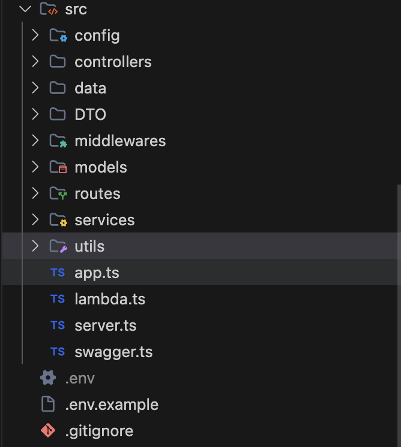
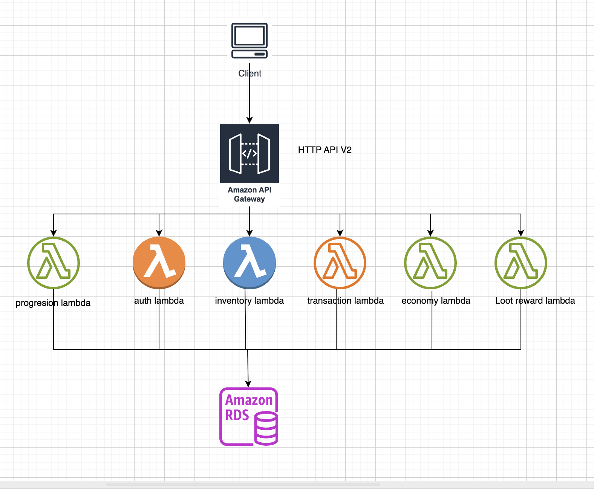

#### 5.4.1 Tổng quan kiến trúc

Kiến trúc hệ thống trước dự án trước khi triển khai:



Kiến trúc hệ thống sau khi triển khai với serverless (Lambda):

```
├── lambda-auth
│   ├── .serverless
│   │   ├── cloudformation-template-create-stack.json
│   │   ├── cloudformation-template-update-stack.json
│   │   ├── gameapi-auth.zip
│   │   └── serverless-state.json
│   ├── src
│   │   ├── controllers
│   │   │   └── AccountsController.ts
│   │   ├── index.ts
│   │   ├── lambda.ts
│   │   └── routes.ts
│   ├── Dockerfile
│   ├── package.json
│   ├── serverless.yml
│   └── tsconfig.json
├── lambda-economy
│   ├── .serverless
│   │   ├── cloudformation-template-create-stack.json
│   │   ├── cloudformation-template-update-stack.json
│   │   ├── gameapi-economy.zip
│   │   └── serverless-state.json
│   ├── src
│   │   ├── controllers
│   │   │   └── EconomyController.ts
│   │   ├── index.ts
│   │   ├── lambda.ts
│   │   └── routes.ts
│   ├── Dockerfile
│   ├── package.json
│   ├── serverless.yml
│   └── tsconfig.json
├── lambda-inventory
│   ├── .serverless
│   │   ├── cloudformation-template-create-stack.json
│   │   ├── cloudformation-template-update-stack.json
│   │   ├── gameapi-inventory.zip
│   │   └── serverless-state.json
│   ├── src
│   │   ├── controllers
│   │   │   ├── InventoryController.ts
│   │   │   └── StorageController.ts
│   │   ├── index.ts
│   │   ├── lambda.ts
│   │   └── routes.ts
│   ├── Dockerfile
│   ├── package.json
│   ├── serverless.yml
│   └── tsconfig.json
├── lambda-loot-reward
│   ├── .serverless
│   │   ├── cloudformation-template-create-stack.json
│   │   ├── cloudformation-template-update-stack.json
│   │   ├── gameapi-loot-reward.zip
│   │   └── serverless-state.json
│   ├── src
│   │   ├── controllers
│   │   │   ├── ForumController.ts
│   │   │   ├── GameDataController.ts
│   │   │   ├── LeaderboardController.ts
│   │   │   └── SaveDataController.ts
│   │   ├── index.ts
│   │   ├── lambda.ts
│   │   └── routes.ts
│   ├── Dockerfile
│   ├── package.json
│   ├── serverless.yml
│   └── tsconfig.json
├── lambda-progression-world
│   ├── .serverless
│   │   ├── cloudformation-template-create-stack.json
│   │   ├── cloudformation-template-update-stack.json
│   │   ├── gameapi-progression-world.zip
│   │   └── serverless-state.json
│   ├── src
│   │   ├── controllers
│   │   │   ├── FarmController.ts
│   │   │   └── PlayerStatsController.ts
│   │   ├── index.ts
│   │   ├── lambda.ts
│   │   └── routes.ts
│   ├── Dockerfile
│   ├── package.json
│   ├── serverless.yml
│   └── tsconfig.json
└── lambda-transaction
    ├── .serverless
    │   ├── cloudformation-template-create-stack.json
    │   ├── cloudformation-template-update-stack.json
    │   ├── gameapi-transaction.zip
    │   └── serverless-state.json
    ├── src
    │   ├── controllers
    │   │   ├── GiftCodeController.ts
    │   │   └── ShopController.ts
    │   ├── index.ts
    │   ├── lambda.ts
    │   └── routes.ts
    ├── Dockerfile
    ├── package.json
    ├── serverless.yml
    └── tsconfig.json
```


Hệ thống được xây dựng theo mô hình **Serverless Microservices** trên nền tảng AWS Lambda. Thay vì triển khai toàn bộ backend trong một ứng dụng duy nhất (Monolithic), hệ thống được chia thành nhiều Lambda Functions, mỗi Lambda phụ trách một nhóm nghiệp vụ (Business Domain) riêng.

Mỗi Lambda được triển khai như một dịch vụ độc lập, có thể phát triển, kiểm thử và triển khai riêng biệt. Tất cả các dịch vụ được truy cập thông qua Amazon API Gateway và cùng sử dụng cơ sở dữ liệu Amazon Aurora PostgreSQL.

Kiến trúc này giúp hệ thống dễ mở rộng, giảm chi phí vận hành và tăng khả năng bảo trì.

#### 5.4.2 Luồng hoạt động 



* Client gửi yêu cầu HTTP đến Amazon API Gateway.
* API Gateway xác định Endpoint và định tuyến yêu cầu đến Lambda tương ứng.

* Lambda được kích hoạt và khởi tạo môi trường thực thi.
* Lambda chuyển yêu cầu đến Controller phù hợp để xử lý nghiệp vụ.

* Controller truy cập Amazon Aurora PostgreSQL để đọc hoặc ghi dữ liệu.
* Sau khi xử lý xong, Lambda trả kết quả về API Gateway.

* API Gateway gửi phản hồi cuối cùng về cho Client.
